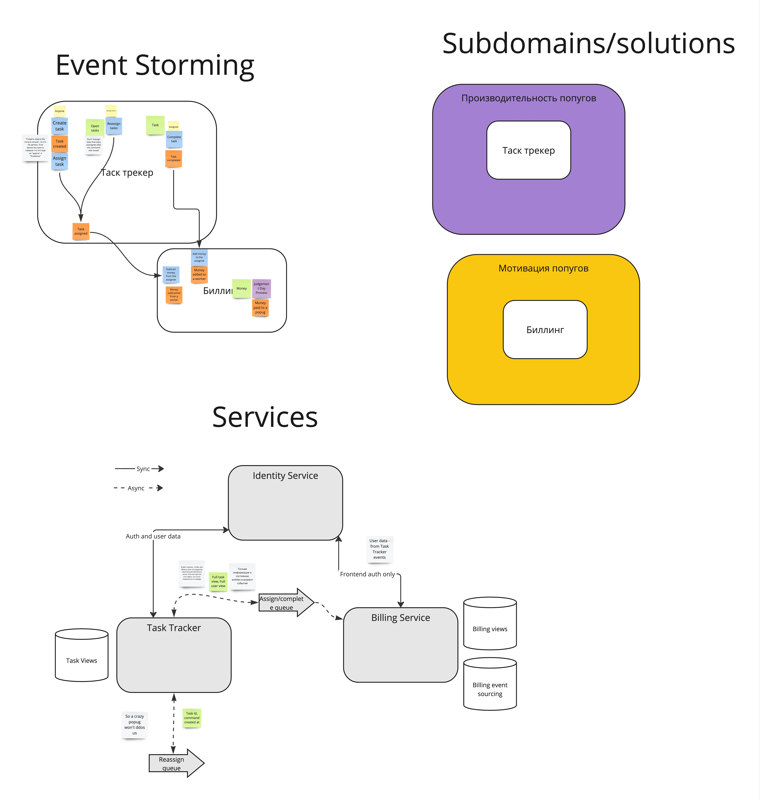
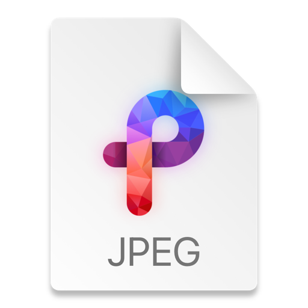

> Положить все, что вы сделали к нулевому уроку в отдельную папку или отдельный файл. Нам важно сохранить все так как есть сейчас, что бы вернуться к этому проектированию в конце курса для сравнения как было в начале и как получилось в конце. Сейчас мы спроектируем ту же систему по новой, используя подходы из курса. А в следующих неделях реализуем то, что будем сейчас проектировать.

https://www.notion.so/Popugi0-Igor-Loskutov-cdfdcbc870aa490f95b45086a4375234

homework0.jpg - snapshot on Jul30 2023

> Разобрать каждое требование на составляющие (актор, команда, событие, query). Определить, как все бизнес цепочки будут выглядеть и на какие шаги они будут разбиваться.

> Построить модель данных для системы и модель доменов. Рисовать можно в любом удобном инструменте (включая обычную бумагу), главное, чтобы это было не только у вас в голове, но и где-то вовне. Благодаря этому вы сможете сфокусироваться на отдельной части системы, не думая о других. А также показать свое решение одногрупникам/коллегам.
 

> Определить, какие общие данные нужны для разных доменов и как связаны данные между разными доменами.
 
Таск Трекер - читает юзеров

Биллинг - читает юзеров, знает состояние тасков на момент бизнес-событий из самих бизнес-событий

> Разобраться, какие сервисы, кроме тудушника, будут в нашей системе и какие между ними могут быть связи (как синхронные, так и асинхронные).
 
Биллинг - знает об ивентах "Таск Назначен" и "Таск Сделан". Пока что всё.

> Определить все бизнес события, необходимые для работы системы. Отобразить кто из сервисов является продьюсером, а кто консьюмером бизнес событий.
 
Трекер -> Таск Назначен / Таск Сделан -> Биллинг 

> Выписать все CUD события и какие данные нужны для этих событий, которые необходимы для работы системы. Отобразить кто из сервисов является продьюсером, а кто консьюмером CUD событий.

Трекер и Биллинг читают Юзеров по CUD для аутентификации

NB! Биллинг читает Юзеров из бизнес событий Таск Назначен / Таск Сделан, чтобы четко иметь представление о "Юзере в момент события".

